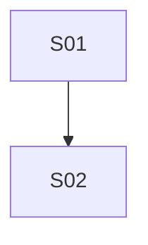

# 流程与功能对齐 — SaaS身份平台

> 人填、人评审。机器只检查引用的功能 ID 是否存在。
> 评审时把流程图投出来，逐行念「这一步靠哪些功能完成」。念不出来的行，
> 要么流程是空的，要么功能是缺的。这就是对齐的全部意义。

## FLOW-01 （主流程名）

| 步骤 | 名称 | 角色 | 输入 | 输出 | 状态流转 | 支撑功能子项 |
|---|---|---|---|---|---|---|
| S01 | | | | | | |

### 评审时问这四个问题

1. 有没有哪个步骤的「支撑功能子项」是空的？→ 功能缺失，或这一步不该存在
2. 有没有功能子项从头到尾没出现在任何流程里？→ 见下方孤儿清单
3. 状态流转列里的状态名，和代码里的枚举一致吗？→ 不一致就是两套真相
4. 退回路径都画了吗？→ 只画正向流程，会漏掉一半功能

### 孤儿功能

不在任何流程里但合法的功能。**没解释的孤儿 = 没人要的功能。**

| 功能 ID | 为什么合法 |
|---|---|

---

## FLOW-02 （异常流程名）

> 异常流程单独成表，否则它承载的功能永远是孤儿。
